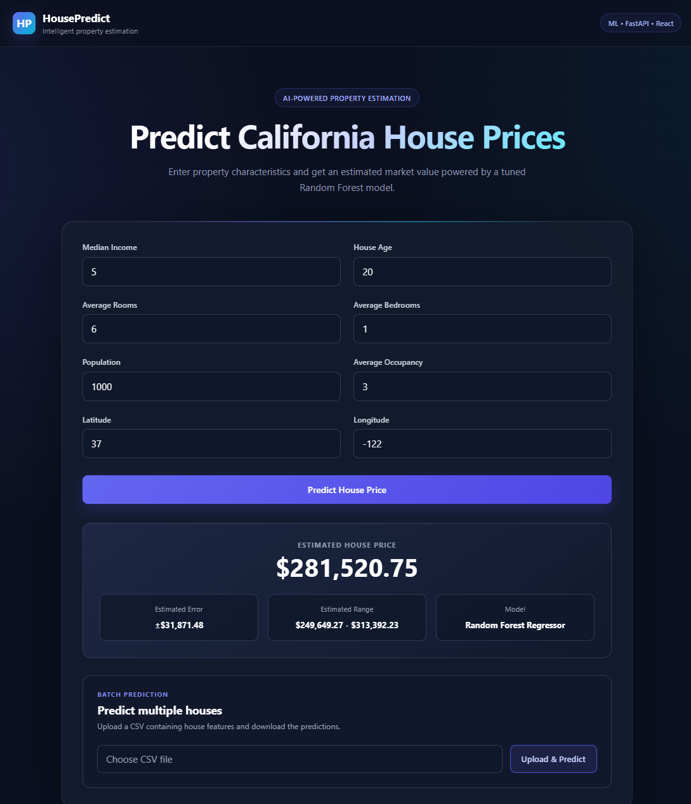
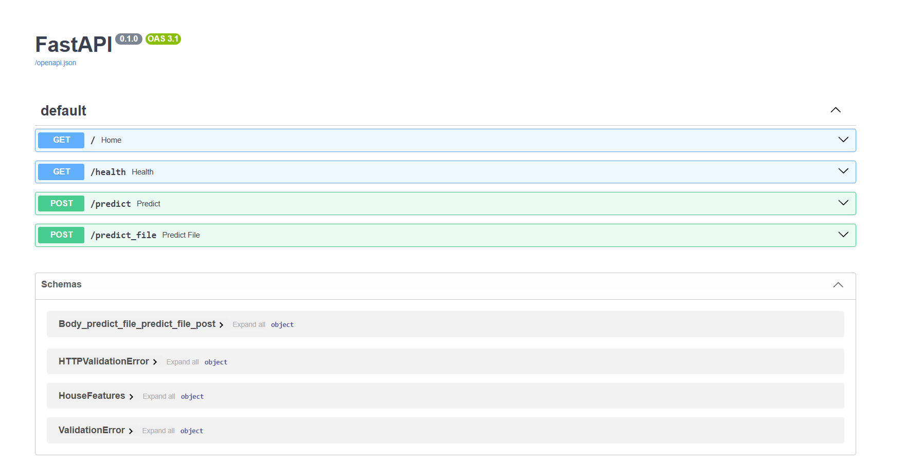
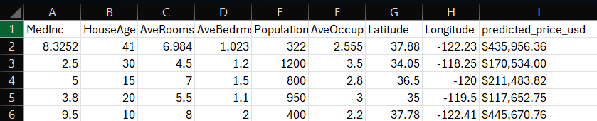
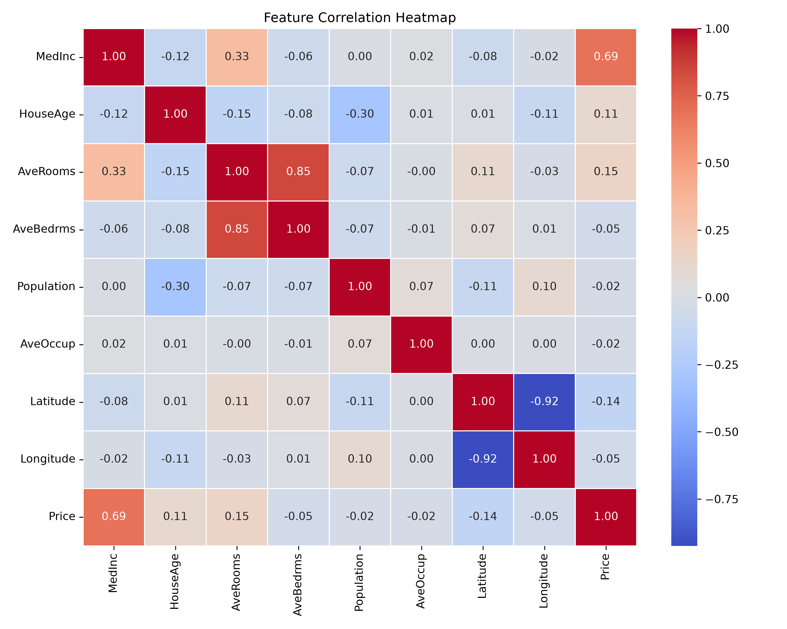

# 🏠 House Price Prediction

An end-to-end machine learning application for predicting California house prices using **Scikit-learn, FastAPI, React, and Docker**.

The project covers the complete workflow from exploratory data analysis and model selection to API development, a React frontend, automated testing, and containerized deployment.

---

## 🚀 Project Overview

This application predicts the estimated value of a California house based on eight characteristics:

* Median income
* House age
* Average rooms
* Average bedrooms
* Population
* Average occupancy
* Latitude
* Longitude

The machine learning model is exposed through a **FastAPI REST API**, while a **React frontend** provides an interactive interface for making individual and batch predictions.

---

## ✨ Features

* Exploratory Data Analysis with visualizations
* Comparison of multiple regression models
* Random Forest hyperparameter tuning
* Feature importance analysis
* Reproducible model training and evaluation
* FastAPI prediction API
* Pydantic input validation
* Single-house prediction
* CSV batch prediction
* React frontend
* Responsive dark-themed UI
* React → FastAPI API integration
* CSV upload and prediction download
* Automated API tests with Pytest
* Dockerized backend
* Dockerized frontend with Nginx
* Docker Compose for running the complete application

---

## 🛠️ Tech Stack

### Machine Learning

* Python
* Pandas
* NumPy
* Scikit-learn
* Matplotlib
* Seaborn
* Joblib

### Backend

* FastAPI
* Pydantic
* Uvicorn
* Pytest

### Frontend

* React
* Vite
* JavaScript
* CSS

### Deployment / DevOps

* Docker
* Docker Compose
* Nginx

---

## 🏗️ Architecture

```text
                    ┌──────────────────────┐
                    │      React UI        │
                    │      Port 3000       │
                    └──────────┬───────────┘
                               │
                         HTTP / JSON
                               │
                               ▼
                    ┌──────────────────────┐
                    │      FastAPI         │
                    │      Port 8000       │
                    └──────────┬───────────┘
                               │
                               ▼
                    ┌──────────────────────┐
                    │ Tuned Random Forest  │
                    │     ML Model         │
                    └──────────────────────┘
```

For batch prediction, the React frontend uploads a CSV file to FastAPI, which returns a generated prediction CSV.

---

## 📊 Dataset

The project uses the **California Housing dataset** available through Scikit-learn.

The dataset contains:

* 20,640 records
* 8 input features
* 1 target variable (`Price`)

The target is represented in units of hundreds of thousands of US dollars.

---

## 🔍 Exploratory Data Analysis

The EDA included:

* Dataset structure and statistics
* Missing-value analysis
* Duplicate-row analysis
* Target distribution
* Correlation heatmap
* Feature vs. price analysis
* Geographic price distribution
* Boxplot-based outlier inspection

### Key observations

`MedInc` showed the strongest simple relationship with house price, with a correlation of approximately **0.69**.

The geographic visualization also showed clear spatial patterns in house prices, indicating that location contributes meaningful predictive information.

Several features contained extreme observations, particularly `AveRooms`, `AveBedrms`, `Population`, and `AveOccup`. These observations were retained rather than removed automatically because they were not established to be invalid data.

EDA visualizations are available in:

```text
reports/figures/
```

---

## 🧩 Engineering Challenges

During development, several practical issues were encountered and resolved:

- Configured CORS to allow communication between the React frontend and FastAPI backend during development and Dockerized execution.
- Separated model artifacts, API code, ML scripts, and frontend code into a maintainable project structure.
- Added structured frontend handling for FastAPI validation errors.
- Containerized both the React frontend and FastAPI backend and orchestrated them with Docker Compose.
- Verified that the tuned Random Forest improved over the baseline model using the same test set.

---

## 🤖 Model Comparison

Three regression models were evaluated using the same train/test split:

| Model             |        MAE |       RMSE |         R² |
| ----------------- | ---------: | ---------: | ---------: |
| Linear Regression |     0.5332 |     0.7456 |     0.5758 |
| Decision Tree     |     0.4542 |     0.7030 |     0.6228 |
| **Random Forest** | **0.3277** | **0.5060** | **0.8046** |

Random Forest produced the best results across all three evaluation metrics and was therefore selected for further tuning.

The detailed comparison is available in:

```text
reports/model_comparison.csv
```

---

## 🎯 Hyperparameter Tuning

The Random Forest model was tuned using `RandomizedSearchCV` with 5-fold cross-validation.

The search included:

* `n_estimators`
* `max_depth`
* `min_samples_split`
* `min_samples_leaf`
* `max_features`

### Best Configuration

```text
n_estimators      = 400
max_depth         = None
min_samples_split = 2
min_samples_leaf  = 1
max_features      = log2
```

The tuned model was then evaluated on the same untouched test set used for the baseline comparison.

### 🚀 Deployment Training

Hyperparameter tuning is performed during model development using:

```text
ml/train.py
```

For deployment, the selected hyperparameters are reused in:

```text
ml/train_deployment.py
```

This script trains the final Random Forest **without repeating the expensive hyperparameter search**, keeping Docker builds lightweight while preserving the tuned model configuration.

### Training Workflow

```text
Model Development
       ↓
RandomizedSearchCV
       ↓
Best Hyperparameters
       ↓
Held-out Test Evaluation
       ↓
Deployment Training
       ↓
Final Docker Model
```

> **Note:** The reported evaluation metrics come from the held-out test-set evaluation performed during model development. The deployment script reuses the selected hyperparameters to reproduce the final model without running the search again.


---

## 📈 Final Model Performance

### Tuned Random Forest

| Metric |        Result |
| ------ | ------------: |
| MAE    | **≈ $31,871** |
| RMSE   | **≈ $48,861** |
| R²     |    **0.8178** |

Compared with the baseline Random Forest:

```text
MAE : 0.3277 → 0.3187
RMSE: 0.5060 → 0.4886
R²  : 0.8046 → 0.8178
```

The tuned model therefore improved performance on the test set.

The trained model files are generated locally by running:

python ml/train.py

This creates:
models/
├── house_model.joblib
└── house_features.joblib

Model evaluation metrics are tracked in:
models/model_metrics.json

> For the deployed application, a lighter 100-tree Random Forest using the same tuned hyperparameters was selected to fit the memory constraints of the free hosting environment. Its test-set R² is 0.8145.

---

## 🔎 Feature Importance

The final Random Forest identified the following feature importance values:

| Feature      | Importance |
| ------------ | ---------: |
| `MedInc`     | **0.5250** |
| `AveOccup`   |     0.1384 |
| `Latitude`   |     0.0890 |
| `Longitude`  |     0.0885 |
| `HouseAge`   |     0.0546 |
| `AveRooms`   |     0.0442 |
| `Population` |     0.0307 |
| `AveBedrms`  |     0.0297 |

`MedInc` was by far the most important feature for the trained Random Forest.

---

## ⚡ FastAPI

The backend provides the following endpoints:

| Method | Endpoint        | Description                       |
| ------ | --------------- | --------------------------------- |
| GET    | `/`             | API status                        |
| GET    | `/health`       | Model and performance information |
| POST   | `/predict`      | Predict a single house price      |
| POST   | `/predict_file` | Predict prices for a CSV file     |

Interactive API documentation is available through FastAPI Swagger UI:

```text
http://localhost:8000/docs
```

### Example prediction request

```json
{
  "MedInc": 5,
  "HouseAge": 20,
  "AveRooms": 6,
  "AveBedrms": 1,
  "Population": 1000,
  "AveOccup": 3,
  "Latitude": 37,
  "Longitude": -122
}
```

### Example response

```json
{
  "predicted_price_usd": 281520.75,
  "estimated_error_usd": 31871.48,
  "prediction_range": {
    "lower": 249649.27,
    "upper": 313392.23
  },
  "model": "Random Forest Regressor"
}
```

The prediction range is presented as an estimated error range based on the model's MAE; it is not a statistical confidence interval.

---

## 🎨 React Frontend

The frontend provides:

* Property input form
* Client-side state management
* API integration with FastAPI
* Prediction result display
* Estimated error and prediction range
* Model information
* CSV batch prediction
* CSV download
* Loading and error states
* Responsive dark-themed interface

The frontend communicates with the backend using HTTP requests.

---

## 📁 Project Structure

```text
house_prediction_api/
│
├── app/
│   ├── __init__.py
│   ├── main.py
│   └── schemas.py
│
├── data/
│   └── test_houses.csv
│
├── frontend/
│   ├── .env.example
│   ├── .gitignore
│   ├── Dockerfile
│   ├── package.json
│   └── src/
│       ├── App.jsx
│       ├── App.css
│       ├── index.css
│       ├── main.jsx
│       └── components/
│           ├── Header.jsx
│           ├── PredictionForm.jsx
│           └── PredictionForm.css
│
├── ml/
│   ├── explore.py
│   └── train.py
│
├── models/
│   └── model_metrics.json
│
├── reports/
│   ├── model_comparison.csv
│   └── figures/
│
├── tests/
│   └── test_api.py
│
├── .dockerignore
├── .gitignore
├── Dockerfile
├── docker-compose.yml
├── requirements.txt
└── README.md
```

---

## 🧪 Testing

The backend includes automated tests using Pytest.

The current test suite covers:

* Home endpoint
* Health endpoint
* Valid prediction
* Invalid prediction input
* CSV batch prediction

Run the tests with:

```bash
python -m pytest
```

Expected result:

```text
5 passed
```

---

## 🐳 Run with Docker Compose

Make sure Docker Desktop is running.

Then, from the project root, start the complete application:

```bash 
docker compose up --build
```

During the backend image build, the machine learning training script is automatically executed to generate the required model files.

This starts:

```text 
React frontend  → http://localhost:3000
FastAPI backend → http://localhost:8000
```

Open the application:

```text 
http://localhost:3000
```

Open the API documentation:

```text 
http://localhost:8000/docs
```

To stop the application:

```bash 
docker compose down
```

---

## 💻 Run Locally Without Docker


### Backend

Create and activate a Python virtual environment, then install dependencies:

```bash
pip install -r requirements.txt
```
Run the training script once to generate the required model files:

```bash
python ml/train.py
```

This creates:

```text
models/
├── house_model.joblib
└── house_features.joblib
```

Start FastAPI:

```bash
uvicorn app.main:app --reload
```

### Frontend

Move into the frontend directory:

```bash
cd frontend
```

Install dependencies:

```bash
npm install
```

Create `.env` using `.env.example` as a template:

```env
VITE_API_URL=http://127.0.0.1:8000
```

Start the development server:

```bash
npm run dev
```

The frontend will normally be available at:

```text
http://localhost:5173
```

---

## 📸 Screenshots

### React Frontend



### FastAPI Swagger UI



### Batch Prediction



### Exploratory Data Analysis



---

## 🔮 Future Improvements

Possible future improvements include:

* Additional model experimentation
* More advanced model interpretability
* Improved prediction uncertainty estimation
* Cloud deployment
* More advanced geographic visualization
* Automated CI workflows

---

## 📌 Disclaimer

This project is intended for educational and portfolio purposes.

Predictions are generated from a machine learning model trained on the California Housing dataset and should not be treated as professional real-estate valuations.

---

## 👨‍💻 Project

**House Price Prediction — ML + FastAPI + React + Docker**

Built as an end-to-end machine learning application demonstrating model development, API integration, frontend development, testing, and containerization.
